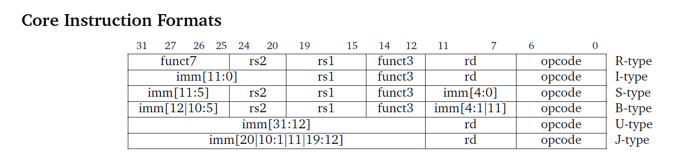
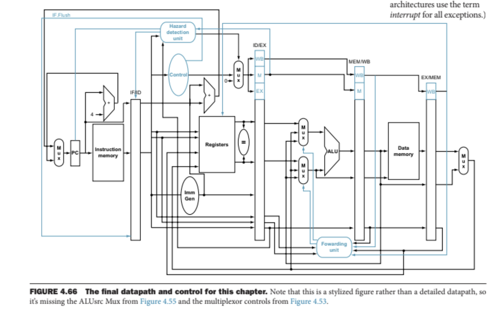
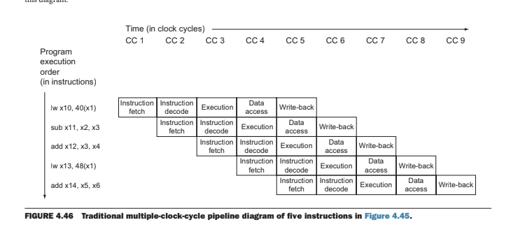

# 5-Stage Pipelined RV32I Processor

**Built using Verilog | RTL based CPU design**

## Overview

This project is a custom-designed 32 bit 5 stage pipelined RV32I processor, it supports R,I,S,B,U and J instructions and handles various pipeline hazards using efficient architectural techniques

The processor simulates intruction execution through five stages:
**IF → ID → EX → MEM → WB**, with custom hazard resolution techniques for **Data**,**Control** and **Structural hazards**.

---

## Instruction Format

The RV32I intruction set architecture supports 6 type of instructions

- **R-type**: Used for register-to-register ALU operations
- **I-type**: Used for immediate operations, memory access
- **B-type**: Used for branch instructions
- **J-type**: Used for jump instructions
- **S-type**: Used for store instructions
- **U-type**: Used for upperImm instructions

---

## Key features

- Fully functional **32-bit pipelined CPU** in Verilog
- Efficient handling of **data**, **control** and **Structural hazards**
- Used **harvard architecture** ,i.e the data and instruction memory are different avoiding structural hazards

---

## Architectural Overview of the pipeline

The processor follows a classic 5-Stage pipeline and manages instruction/control flow through the following data path consisting of:

### Pipelined Stages

1. **IF (Instruction Fetch)**  
   Fetches instruction from memory and calculates next PC.

2. **ID (Instruction Decode & Register Fetch)**  
   Decodes opcode, reads registers, and performs sign extension for immediate values.

3. **EX (Execution/Address Calculation)**  
   Executes ALU operations or computes branch target addresses.

4. **MEM (Memory Access)**  
   Loads data from memory or writes to memory.

5. **WB (Write Back)**  
   Writes result back to register file.

---

## Clock cycle Execution

  The pipelined design allows multiple instructions to be in different stages of execution simultaneously. Below is a visual representation:

  

  Each instruction progresses one stage per clock cycle, and pipeline is kepy bust with new instructions every clock cycle.

  ---

  ## Hazard Handling

  - **Data Hazards**
    Managed using **Data forwarding** and **Hazard detection unit** for detecting load use stalls with controlled **stalling**. This ensures the operands are ready to be used in the ALU.

  - **Control Hazards**
    Handled by evaluating branch conditions in the **EX stage**. if a branch is taken, the IF and ID stage are **flushed**, resulting in minimal penalty.

  - **Structural Hazards**
    Eliminated by using **Separate instruction and data memories (Harvard Architecture)**, and a **two-read, one-write register bank (32x32)**

 ---

 ## Design Decisions

 - Inter-stage pipeline registers (e.g., `IF_ID_IR`,`ID_EX_A`) store intermediate values and control signals.
 - Memory is modeled as 4KB array (`Mem[4095:0]`).
 - Register file consists of 32 general-purpose registers (`Reg[31:0]`).
 - custom `TYPE` control values values distinguish instruction categories in pipeline stages.

---

## Technologies Used

  - **Verilog HDL**
  - **RTL Design Methodology**
  - **Design Logic and computer Architecture**
  - Simulated using **Icarus-Verilog** and **GTK-wave**.

---

##  Testing

  - Tested the RV32I 5 stage pipeline using **Bell-man ford algorithm**,compiled using RISC-V tool chain and successfully verified on custom processor

